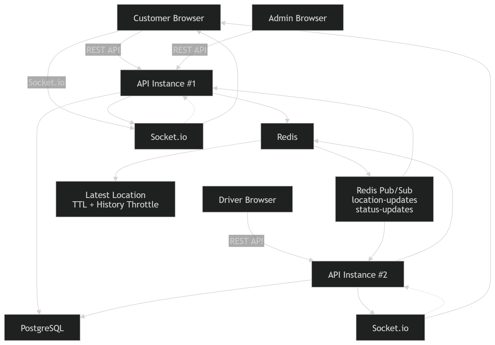
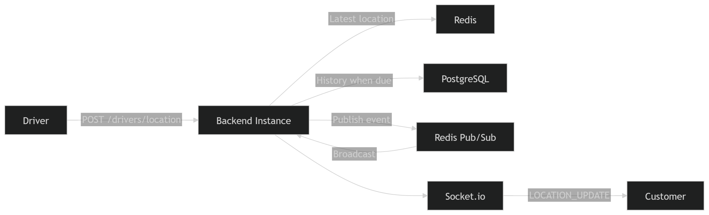
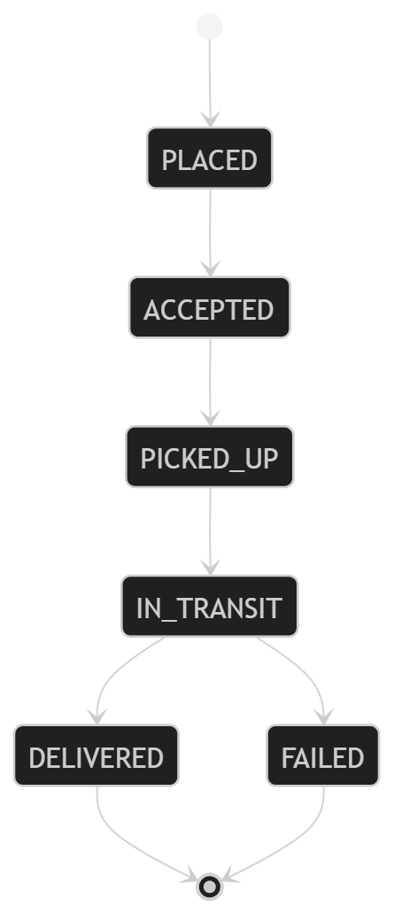
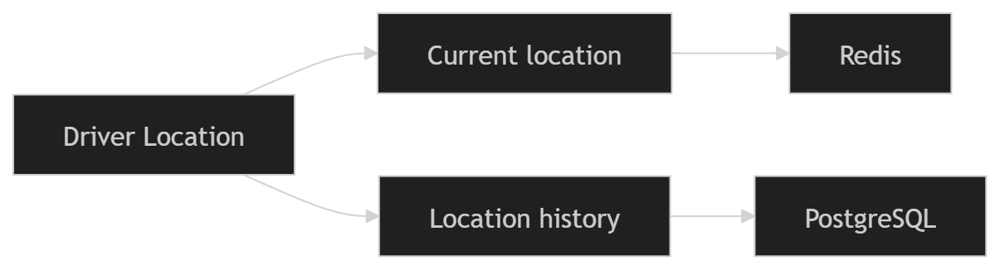
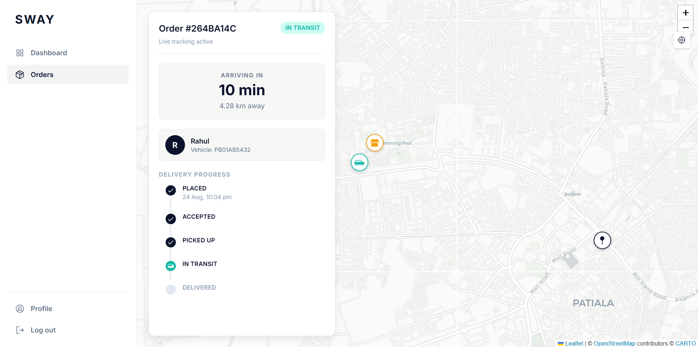
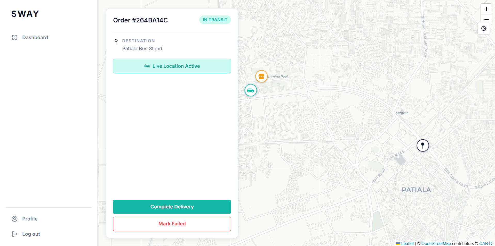
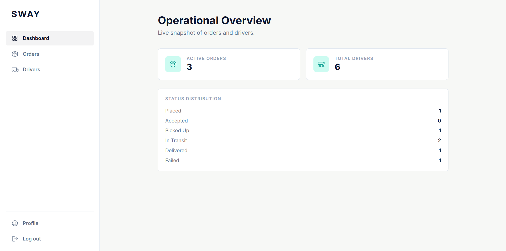

# SWAY

### Real-Time Order Tracking Platform

SWAY is a delivery tracking platform where customers can track drivers in real time, drivers can manage deliveries, and admins can monitor orders.

---

## Architecture



---

## How It Works



When a driver sends a location update:

```text
Driver
  ↓
Backend
  ↓
Redis + PostgreSQL
  ↓
Redis Pub/Sub
  ↓
Socket.io
  ↓
Customer
```

Redis keeps the latest location, while PostgreSQL stores the location history.

---

## Multiple Backend Instances


SWAY can run on multiple backend instances.

Redis Pub/Sub sends realtime updates between them, so a customer can still receive updates even when the driver request reaches another backend instance.

---

## Order Flow



---

## Data Storage



### PostgreSQL

Stores users, orders, drivers and location history.

### Redis

Stores the latest driver location and handles realtime communication between backend instances.

---

## Screens

### Customer



### Driver



### Admin



---

## Tech Stack

**Backend:** Node.js, Express, PostgreSQL, Prisma, JWT, Zod

**Realtime:** Redis, Redis Pub/Sub, Socket.io

**Frontend:** React, Vite, Tailwind CSS, TanStack Query, Leaflet, Phosphor Icons

**Tools:** Docker, Docker Compose

---

## Run Locally

### Backend

```bash
cd backend
npm install
npm run dev
```

### Frontend

```bash
cd frontend
npm install
npm run dev
```

Create your `.env` files using the provided `.env.example`.

### Docker

```bash
docker compose up --build
```

---

## Limitations

- ETA is an estimate
- Haversine gives straight-line distance, not road distance
- Redis Pub/Sub does not store missed messages
- Redis is currently a single point of failure

## Future Additions

- Add a load balancer for better traffic handling
- Add Redis high availability
- Improve ETA using real road and traffic data
- Add smarter driver assignment
- Improve GPS smoothing for better location accuracy

---

## License

MIT — see [LICENSE](LICENSE) for details.
